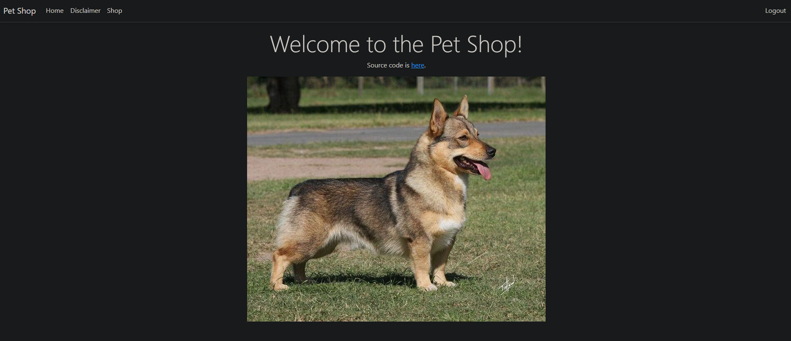

# Simple MVC Petshop

A basic web project built using the MVC framework and ASP.NET 7.0.

Features include:
* MSSQL backend database
* Login authentication
* Administrative interface with CRUD features.

Created this to learn more about MVC frameworks and C# for web development.

## Credentials

Admin: `admin:7h15_15_mvc_p37_5h0p!`

User: `user:normalpassword`

## Known Bugs

The database might fail for some reason. A user might have to run `Update-Database` in NuGet Package Manager after cloning to make it work properly.